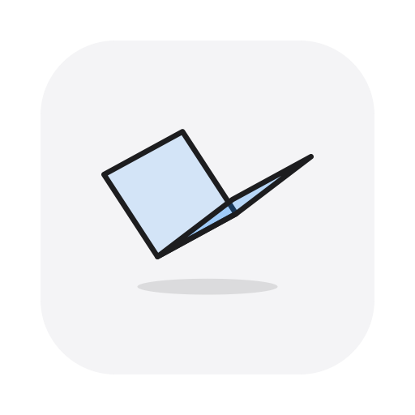
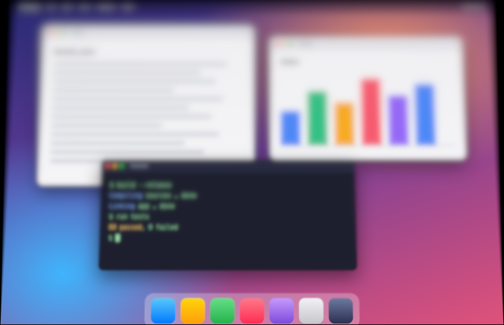
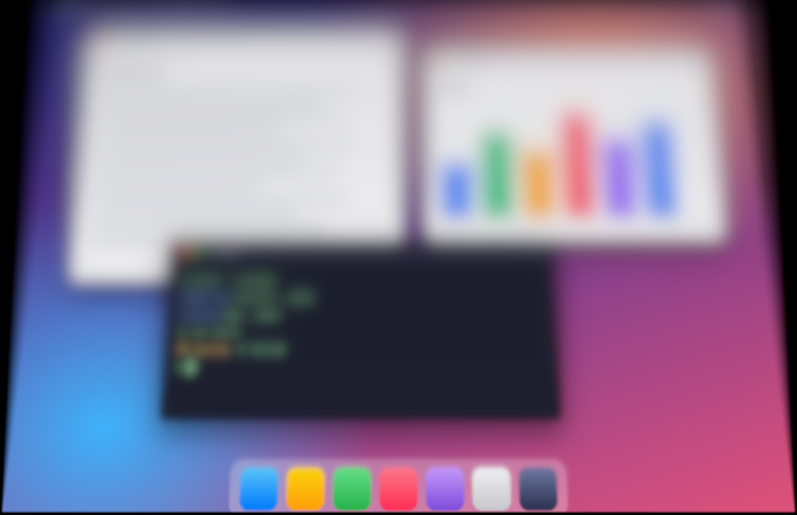

<p align="center">
  
</p>

<p align="center"><b>English</b> | <a href="README.zh-CN.md">简体中文</a></p>

# Mac Duo

Mac Duo adds a fold transition to the MacBook lid. When you close the lid, the desktop stays fixed
at your working angle and the screen acts like a pane of frosted glass turning away from it. Content
near the hinge stays sharp and gets softer towards the top edge. When the lid comes back to the
working angle, the picture is sharp again.

The app reads the MacBook's built-in lid-angle sensor and redraws the live desktop on the GPU in a
click-through overlay. At your working angle it leaves the screen untouched.

<p align="center">
  
  
</p>
<p align="center"><sub>Illustration: the optical model applied to a sample desktop. Release angle 95°, lid at 88° (left) and 80° (right).</sub></p>

## Requirements

- An Apple silicon MacBook with a lid-angle sensor. Mac Duo was developed and tested on a MacBook
  Pro with M5 Pro. The Status tab in Settings shows whether your Mac's sensor was found.
- macOS 26 or later.
- For building: Xcode 26 or later with the Metal toolchain, and
  [XcodeGen](https://github.com/yonaskolb/XcodeGen).

## Install

**Download.** Get `MacDuo-<version>-arm64.zip` from the
[Releases](https://github.com/DongkunXu/Mac-Duo/releases) page, unzip it and move `MacDuo.app` to
`/Applications`. The build is signed ad hoc and is not notarized, so macOS blocks the first launch.
Allow it in System Settings → Privacy & Security → Open Anyway, or run
`xattr -dr com.apple.quarantine /Applications/MacDuo.app`.

**Build from source.**

```sh
brew install xcodegen
git clone https://github.com/DongkunXu/Mac-Duo.git
cd Mac-Duo
Scripts/install.sh
```

The script builds a Release copy, runs the rendering self-test, installs the app as
`/Applications/MacDuo.app` and opens it. Run the same script to update.

On first launch macOS asks for Screen Recording permission, which Mac Duo uses to redraw the
desktop. Turn it on in System Settings → Privacy & Security → Screen Recording. Then open Mac Duo's
Settings → Status and click **Relaunch**, because a new permission only applies to a newly started
app.

### Signing

By default the app is signed ad hoc, which works without an Apple account. With ad hoc signing,
macOS links the Screen Recording permission to one specific build, and you need to grant it again
after each update. To keep the permission across updates, sign with your own certificate: copy
`Config/Signing.local.xcconfig.example` to `Config/Signing.local.xcconfig` and fill in your identity
and team. Git ignores that file.

### Uninstall

Quit Mac Duo, delete `/Applications/MacDuo.app`, run `defaults delete com.dongkunxu.macduo`, and
remove Mac Duo from the Screen Recording list in System Settings.

## Using Mac Duo

Mac Duo runs in the menu bar only.

- **Menu bar panel**: on/off switch, live lid angle, current state, release angle slider, presets,
  pause and Settings.
- **Release angle**: the effect works below this angle and the desktop stays untouched at and above
  it. The default is 95°, adjustable from 60° to 120° in 0.5° steps. A value slightly below your
  usual working angle works well.
- **Settings → Tuning**: all parameters of the motion model and the glass effect. Changes apply
  immediately while you move the lid.
- **Settings → Presets**: saves and restores complete sets of parameters.
- **Pause**: press ⌃⌥⌘D anywhere.
- **Language**: English or Simplified Chinese, following the system language by default. You can
  pick a language in Settings → Status.

## Behaviour and safeguards

- The release angle is a hard limit: the overlay appears only below it, and 120° is the upper bound
  for any setting. A test runs every motion model through realistic lid movements to check this.
- When the lid stays still below the release angle, for example when you use the laptop half
  closed, the effect clears after 2 seconds. Small adjustments keep it cleared and a deliberate
  movement brings it back.
- The overlay only draws. Clicks go to the windows underneath. It is removed right away on sleep,
  lock, user switch, display changes, sensor loss, capture failure or a GPU error, and it becomes
  visible only after its first frame is drawn.
- Captured frames stay in memory and are never written to disk. The app makes no network requests.

## Power use

The lid is at rest most of the time, and Mac Duo keeps almost everything off in that state.

- **Dormant** (lid at rest): only the lid sensor runs, read 5 times per second at low priority.
  Screen capture, the display link and drawing are stopped. After 30 seconds the overlay's GPU
  memory is released as well.
- **Awake**: starts when the lid moves deliberately. Movement is measured from the position where
  the lid last came to rest, which filters out knocks, desk wobble and typing. Well above the
  release angle, lid movement is ignored. Once awake, capture starts in about 25 ms, the sensor
  is read at 120 Hz and the overlay follows the display's refresh rate. About one second after the
  lid stops and nothing is drawn, the app returns to dormant.

Measured on a MacBook Pro (M5 Pro) with the lid at rest: an earlier always-on version used about
7 % CPU in the app, plus about 13 % of one core in WindowServer for continuous capture. In the
dormant state the app uses about 0.1–0.2 % CPU and capture is off. While the app is awake,
macOS shows its screen recording indicator.

## Limitations

- Works on the built-in display only. External displays are left as they are.
- The lock screen always appears unchanged.
- Content that macOS protects from capture, such as some video, may appear black in the overlay.
- Waking takes one sensor read (up to 0.2 s) plus about 25 ms for the first frame, which can delay
  the start of the effect slightly compared with an always-on design.

## Development

```sh
xcodegen generate
open MacDuo.xcodeproj
```

From the command line:

```sh
# Unit tests: sensor decoding, motion model, release rule, wake detection, parameters, presets
xcodebuild -project MacDuo.xcodeproj -scheme MacDuo -derivedDataPath build/DerivedData test

# Offscreen rendering checks: blur calibration, identity at rest, finite output, GPU time
build/DerivedData/Build/Products/Debug/MacDuo.app/Contents/MacOS/MacDuo --self-test
```

| Path | Contents |
|---|---|
| `Sources/MacDuoKit` | Pure Swift logic: sensor reports, motion model, power decisions, parameters, presets. |
| `Sources/MacDuo` | The app: sensor thread, screen capture, overlay, rendering, effect shaders, UI. |
| `Tests/MacDuoKitTests` | Tests for MacDuoKit (Swift Testing). |
| `Scripts` | `install.sh`, `package.sh`, which builds and checks the zip for the Releases page, and `make-icon.swift`, which draws the app icon. |
| `Config` | Code signing settings. |
| `.github/workflows` | Tests, builds and publishes the app on GitHub. |
| `docs` | [Architecture](docs/ARCHITECTURE.md) and [lid sensor notes](docs/sensor.md). |

UI text is kept in the String Catalogs (`Localizable.xcstrings`) of both targets. Xcode adds new
strings to them when you build.

## Acknowledgements

The optical model comes from [FrostFold](https://github.com/askmaddyy/FrostFold) by Madhav Oberoi
and Elijah Semyonov (MIT License), an iOS demo driven by the gyroscope. Its idea is a fixed content
plane, a fixed eye, glass that rotates 1:1 with the device, and blur proportional to the distance
between glass and content. Mac Duo implements the optics independently for macOS and the lid
sensor, and adds physical millimetre geometry, a variance-matched blur pyramid,
smoothing of the sensor's 10 Hz readings, the release-angle safeguards, and dormant/awake power
management.

## License

[MIT](LICENSE). Mac Duo is an independent project and is not affiliated with Apple.
